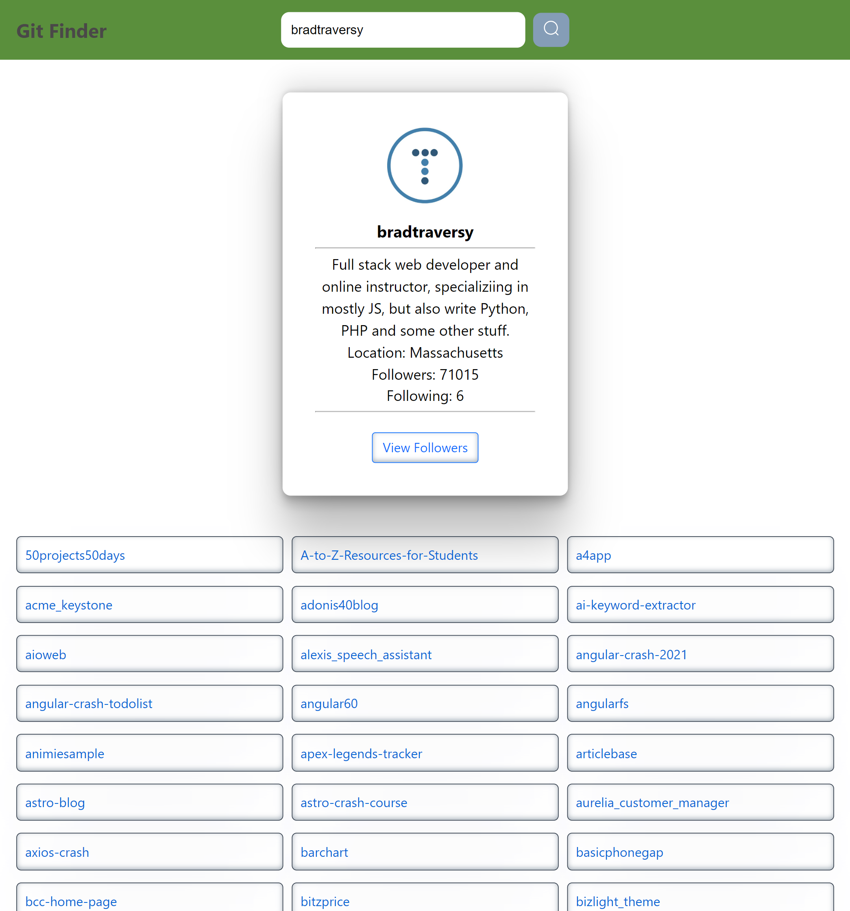
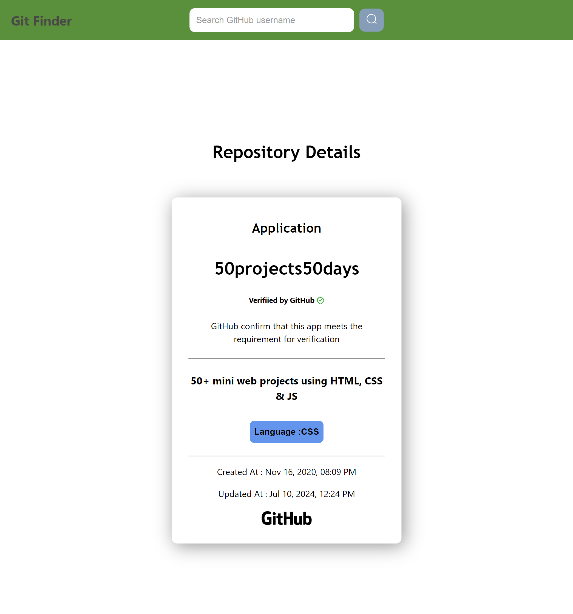

# Autonomize_AI Assignment

## Frontend Deployment

### Overview

This assignment involves building a frontend application that interacts with a backend API to fetch and display GitHub user data. The application allows users to search for GitHub users, view their repositories, see details about specific repositories, and explore followers of the users.

- Enter a GitHub username and click "Search" to explore their repositories and followers.

#### Instructions:

1. Input the GitHub username.
2. Click "Search" to view repositories.
3. Click on any repository to see its description.
4. Find followers by clicking the designated button.
5. Explore repositories of followers by clicking on their usernames.

HomePage:

RepoDetails:

Followers:

## Thank You